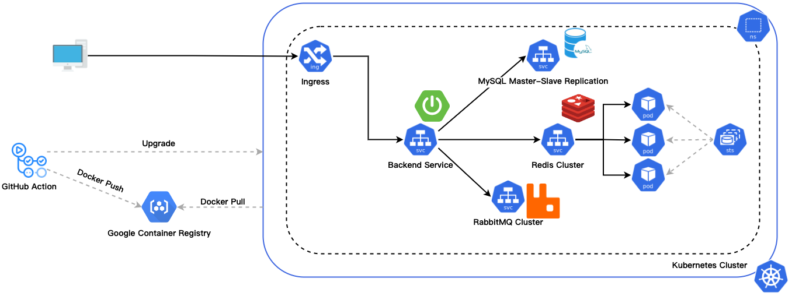

# Spring Boot on Kubernetes

## Overview



Deploy backend cluster services in the cloud via Kubernetes.

Read more about the techniques used [here](https://github.com/RoyDeng/spring-boot-helloworld/wiki).

## Before we start

```bash
# With Minikube installed, you can create a cluster.
minikube start --cpus=2 --memory=2040 --disk-size "20 GB"

# You can verify that the cluster is created.
kubectl cluster-info

# Make sure that your Minikube cluster is running.
minikube status

# We need to create a namespace named helloworld first.
kubectl create namespace helloworld
```

## MySQL Master Slave

### How to deploy it

```bash
# Create storage directories for Persistent Volume on the local node.
minikube ssh
sudo mkdir data && cd $_ && sudo mkdir k8s && cd $_ && sudo mkdir mysql && cd $_ && sudo mkdir mysql-0 && sudo mkdir mysql-1

# Build the Docker image of percona-xtrabackup in local. 
docker build -t "gcr.io/roy-deng-side-project/percona-xtrabackup:8.0" ./k8s/image/percona-xtrabackup

# Load a Docker image from your local machine into the Minikube cluster.
minikube image load percona-xtrabackup:8.0

# Store accounts in secret.
kubectl apply -f ./k8s/mysql/secret.yml

# Deploy storage.
kubectl apply -f ./k8s/mysql/master-slave/pv.yml

# Deploy basic service.
kubectl apply -f ./k8s/mysql/master-slave/config-map.yml
kubectl apply -f ./k8s/mysql/master-slave/service.yml

# Deploy master nodes.
kubectl apply -f ./k8s/mysql/master-slave/master-stateful-set.yml

# Deploy slave nodes.
kubectl apply -f ./k8s/mysql/master-slave/slave-stateful-set.yml
```

## Redis Cluster

### How to deploy it

```bash
# Deploy congig.
kubectl apply -f ./k8s/redis/config-map.yml

# Deploy storage.
kubectl apply -f ./k8s/redis/pv.yml

# Deploy headless service for statefulset.
kubectl apply -f ./k8s/redis/headless-service.yml

# Deploy statefulset.
kubectl apply -f ./k8s/redis/stateful-set.yml

# Get pod ip.
kubectl get pods -l app=redis-cluster-app -o jsonpath='{range.items[*]}{.status.podIP}:6379 ' -n helloworld

# Deploy service.
kubectl apply -f ./k8s/redis/service.yml
```

## RabbitMQ Cluster

### How to deploy it

```bash
# Mount the configuration file into the rabbitmq container by configuring configMap.
kubectl apply -f ./k8s/rabbitmq/config-map.yml

# Write erlang-cookie and default user information into environment variables through secrets.
kubectl apply -f ./k8s/rabbitmq/secret.yml

# Rabbitmq-peer-discovery needs rabc permission to obtain endpoints information for automatic discovery of cluster nodes.
kubectl apply -f ./k8s/rabbitmq/rbac.yml

# Define headless service as the service entry of statefulset.
kubectl apply -f ./k8s/rabbitmq/service.yml

# Deploy using StatefulSet and use dynamic storage volumes to save data.
kubectl apply -f ./k8s/rabbitmq/stateful-set.yml
```

## Spring Boot

### How to deploy it locally

```bash
docker build -t helloworld-app .

docker images

docker network create helloworld

docker run --name=mysql --rm --network=helloworld --hostname mysql -e MYSQL_DATABASE=helloworlddb -e MYSQL_ROOT_PASSWORD={MYSQL_ROOT_PASSWORD} mysql

docker run --name=helloworld-app --rm --network=helloworld -p 8080:8080 -e MYSQL_URL=mysql://mysql:3306/helloworlddb helloworld-app
```

### How to deploy on kubernetes

```bash
# You have to authorise Docker to connect to the Docker Hub account.
docker login

# To rename your image according to this format.
docker tag knote-java <username>/helloworld-app:1.0.0

# Now you can upload your image to docker hub.
docker push username/helloworld-app:1.0.0

# Then submit your resource definitions to kubernetes.
kubectl apply -f k8s

# In Minikube, a Service can be accessed.
minikube service helloworld --url
```

### You can watch how a new Pod is created with:

```bash
kubectl get pods -l app=helloworld-app --watch
```

### How to scale the app

```bash
# Kubernetes makes it very easy to increase the number of replicas to 2.
kubectl scale --replicas=2 deployment/helloworld-deployment
```

## How to debug

```bash
# Watch your Pods coming alive.
kubectl get pods --watch

kubectl get pod -n helloworld

kubectl describe pod mysql-master-0 -n helloworld

kubectl logs mysql-master-0 -c xtrabackup -n helloworld
```

##### Tags: `Spring Boot` `MySQL` `RabbitMQ` `Redis` `Kubernetes` `Docker`